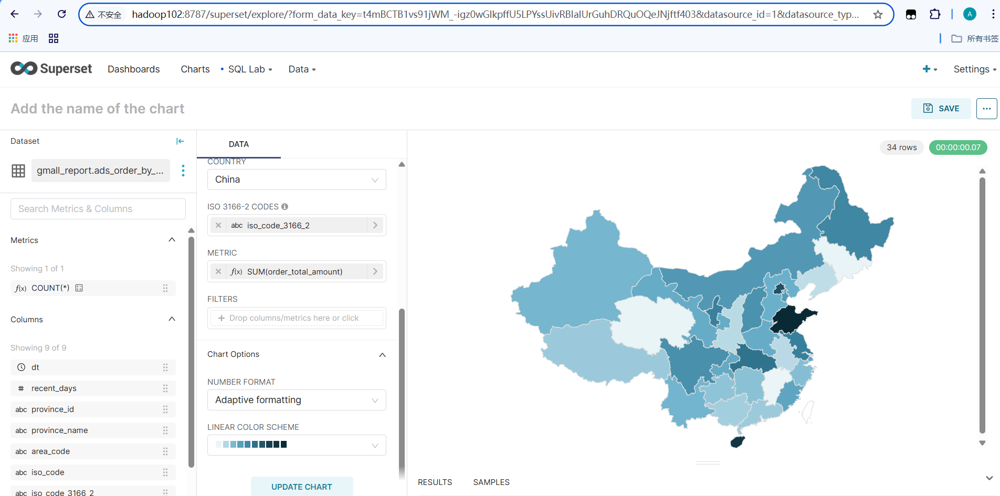

# 电商数仓项目（离线数仓）

## 目录

1. [项目简介](#一项目简介)
2. [技术架构](#二技术架构)
3. [任务调度界面](#三任务调度界面)
4. [软件版本](#四软件版本)
5. [数仓分层结构](#五数仓分层结构)
6. [模块说明](#六模块说明)
7. [运行说明](#七运行说明)
8. [示例图](#八示例图可视化效果展示)

## 一、项目简介

本项目模拟某电商平台的全链路离线数仓体系，涵盖日志采集、业务数据同步、离线ETL、数据建模、任务调度与可视化展示等模块。

## 二、技术架构

**1.系统架构图**

------

**2.架构说明**

​	本数据仓库项目的整体流程分为数据采集、数据处理、数据建模和数据可视化四个阶段。首先，日志或业务数据库中的原始数据通过 Flume、 Kafka、MaxWell和DataX 工具采集或同步后进入HDFS。在数据处理阶段，将数据同步至 ODS 层，并借助 Hive/Spark 进行计算和格式统一。接着，在 DWD 层进行宽表建模和明细数据加工，供后续 DWS 层进行主题宽表聚合，构建面向分析的多维数据集。最终，在 ADS 层形成各类指标主题表，供 BI 工具（如 Apache Superset）进行可视化展示，支持 GMV 趋势图、用户留存分析等核心业务需求。

------

**3. 数据源模块**

本项目的数据源主要包括两类：

- **日志数据**：通过自研日志模拟系统自动生成用户行为日志的模拟数据，支持自定义路径配置与行为权重控制。日志数据可按需投送至文件、Kafka 或 HTTP 接口，主要用于离线数仓行为分析的模拟训练。
- **业务数据**：源自本地 MySQL 中预置的电商业务数据库，为数仓建模提供真实业务数据基础。

------

**4.数据源截图示例**

 * **日志数据源截图**： 

   

 * **业务数据源截图**：

   

------

**5. 数据采集与同步模块**

- **日志数据采集**：采用 Flume 双通道架构完成日志采集与落地。首先，Flume 监听本地生成的日志并将数据发送至 Kafka 作为中间缓存层；随后，另一条 Flume 流从 Kafka 中消费日志数据并写入 HDFS，实现解耦式、高容错的日志采集链路。
- **业务数据采集**：
  - **全量同步**：通过 DataX 工具定时从 MySQL 中全量抽取业务表，直接写入 HDFS；
  - **增量同步**：利用 Maxwell 实时监听 MySQL Binlog，并将变更数据推送至 Kafka。Flume 消费 Kafka 中的增量事件，再将其落地到 HDFS，实现准实时数据采集。

------

**6. 数仓模块**

项目采用五层数仓建模架构：
ODS（Operation Data Store）→ DWD（Data Warehouse Detail ）→ DIM（Dimension）→ DWS（Data Warehouse Summary）→ ADS（Application Data Service）

Hive 作为数仓核心引擎，底层以 Spark 为执行计算框架，确保大数据量处理能力。

------

**7. 数据可视化模块**

ADS 层的结果数据通过脚本同步至 MySQL 数据库，供上层可视化工具读取。项目采用 **Apache Superset** 构建可视化大屏与指标仪表盘，支持 GMV、UV、转化率等业务关键指标展示，实现数据价值的直观呈现。

## 三、任务调度界面

该界面展示了每日定时运行的 ETL 流程，主要包括数据采集、清洗、加载到数据仓库等任务节点。

## 四、软件版本

| 组件/框架        | 版本号             | 说明               |
| ---------------- | ------------------ | ------------------ |
| Hadoop           | 3.3.4              | HDFS 分布式存储    |
| Zookeeper        | 3.7.1              | Kafka 协调器       |
| MySQL            | 8.0.31             | 业务数据存储       |
| Hive             | 3.1.3（修改源码）  | Hive on Spark      |
| Flume            | 1.10.1             | 日志采集工具       |
| Kafka            | 3.3.1              | 日志消息队列       |
| Spark            | 3.3.1              | Hive 执行引擎      |
| DataX            | 3.0（master分支）  | MySQL 全量同步工具 |
| Maxwell          | 1.29.2（修改源码） | MySQL 增量同步工具 |
| DolphinScheduler | 2.0.5（修改源码）  | 离线调度系统       |
| Superset         | 2.0.0              | 数据可视化 BI 工具 |

## 五、数仓分层结构

- **ODS 层**：日志和业务数据的原始接入层；
- **DWD 层**：对 ODS 层数据进行清洗、结构化、归类，形成事实明细表；
- **DIM 层**：构建维度宽表与拉链表，为业务建模提供维度支撑；
- **DWS 层**：基于 DWD + DIM 构建用户、订单等多维度的宽表和周期性汇总表；
- **ADS 层**：沉淀核心指标数据，供供 Apache Superset 等可视化工具读取。

## 六、模块说明

- `/sql/`：Hive 建表、分层 ETL 脚本
- `/scripts/`：采集脚本（Flume、DataX、MaxWell）、调度脚本、集群启动脚本
- `/config/`：Hive的配置文件
- `/mockdata/`：生成模拟数据的 Jar、配置
- `/docs`:存放架构图、数据源、调度以及可视化截图

## 七、运行说明

1. 按照 `/scripts/cluster-control`中的集群启动脚本启动集群
2. 启动模拟数据生成脚本
3. 依次运行 Hive 建表与 ETL 脚本
4. 启动调度任务（如 DolphinScheduler），由于内存资源不足，故采用手动输入命令的方式运行所有调度脚本
5. 连接 Superset 展示结果

## 八、示例图（可视化效果展示）

以下图表截图展示了从 ADS 层同步至 MySQL 后，使用 Superset 可视化的业务指标：

- GMV 趋势图

  

- 优惠卷使次数趋势图

  

- 留存分析图

  

- 全国各省销量

  

---

